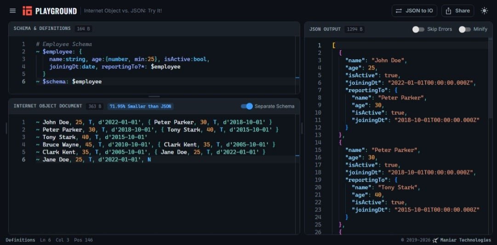

# Internet Object Playground

An interactive editor for [Internet Object](https://www.internetobject.org) — a schema-first, JSON-compatible data format that carries the same data in a fraction of the bytes.

Write a schema, write a document, and watch it parse, validate, and expand into JSON as you type. No install, no signup.

**▶ [play.internetobject.org](https://play.internetobject.org/)**



## What you can do here

- **See the savings.** Every document shows how much smaller it is than the equivalent JSON — the example above is 71.95% smaller.
- **Convert JSON to IO.** Paste any JSON and the playground infers a schema and rewrites it in Internet Object form.
- **Separate schema from data.** Toggle the schema into its own pane to see how IO keeps structure out of the payload.
- **Catch errors as you type.** Parse and validation errors are listed as you go; click one to jump straight to it in the editor.
- **Share what you build.** Any document can be turned into a link that restores the exact editor state.
- **Learn from examples.** A library of samples covers the basics through to schemas, collections, and edge cases.

It stays responsive on large documents by parsing in a Web Worker, works on mobile, and follows your system's light or dark theme.

## Run it locally

```bash
npm install
npm run dev          # http://localhost:4000
```

The playground builds against the [`internet-object`](https://github.com/maniartech/InternetObject-js) library in a sibling folder (`../io-js2`). To point it somewhere else:

```bash
npm run config-io -- ../path/to/library
```

> **Note:** the library is a local `file:` dependency, which package managers *copy* rather than link. After changing the library, rebuild it and re-install here (`npm install --force`) or the playground will keep bundling the previous copy.

## Development

| Script | Purpose |
| ------ | ------- |
| `npm run dev` | Start the dev server on port 4000 |
| `npm run build` | Production build into `build/` |
| `npm run build:check` | Type-check, then build |
| `npm run preview` | Serve the production build locally |
| `npm test` | Run tests in watch mode |
| `npm run test:run` | Run tests once (CI) |
| `npm run audit` | Check dependencies for vulnerabilities |
| `npm run security:audit` | Full security audit |

Built with React 19, TypeScript, MUI, Monaco, and Vite. The playground is versioned by publish date (`YYYYMMDD`), stamped into the build and printed in the browser console.

## Documentation

- **[Accessibility](./docs/ACCESSIBILITY.md)** — WCAG 2.1 AA, keyboard navigation, screen readers
- **[Web Worker](./docs/WEB_WORKER.md)** — how background parsing keeps the editor responsive
- **[Security](./SECURITY-AUDIT.md)** — audit guidelines, and the [quick reference](./SECURITY-QUICK-REF.md)

For the format itself, see the [specification](https://docs.internetobject.org).

## License

Copyright © 2019–2026 ManiarTech® (Maniar Technologies).

The **Internet Object Playground** is licensed under the
[GNU Affero General Public License v3.0](LICENSE) (AGPL-3.0-only).

You are free to use, study, modify, and self-host it. The one condition: if you run a
modified version of the playground and let anyone else use it over a network, you must
make your modified source available to those users under the same license. In short —
host it freely, but give your changes back.

> **Note:** this copyleft applies to the *playground* only. The `internet-object`
> library itself is separately licensed under the permissive
> [Apache License 2.0](https://github.com/maniartech/InternetObject-js), so using
> Internet Object in your own application places no obligations on you — commercial or
> closed-source use is fine, and it carries an explicit patent grant.

*Internet Object* is a trade name and unregistered (common-law) trademark of Maniar
Technologies. The AGPL grants rights to the *code*, not to the name or the logos — so if
you publish a fork or host a modified instance, please give it your own name and
branding.
